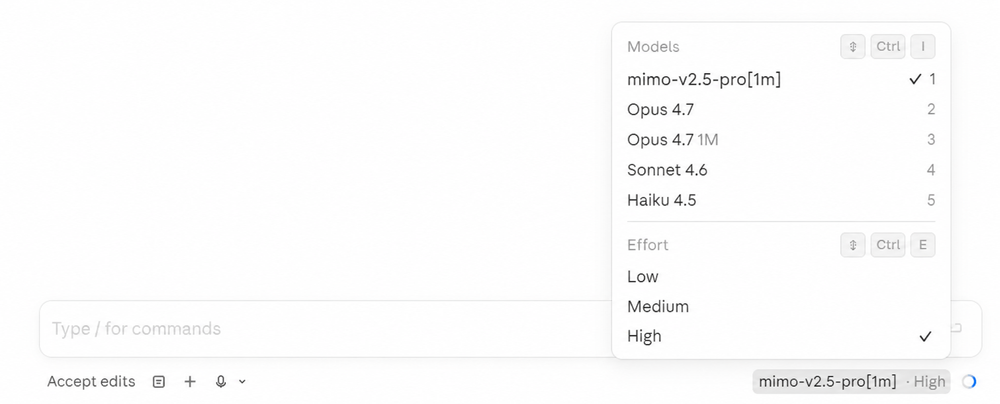

# mimoclaude

Use Claude Code's autonomous agent loop with **Xiaomi MiMo V2.5 Pro**. Same UX, 7x cheaper, 1M token context window.



## What this does

Claude Code is the best autonomous coding agent — but it costs $200/month with usage caps. Xiaomi MiMo V2.5 Pro offers 1M token context at $0.435/M input and $0.87/M output tokens — with permanent flat pricing regardless of context length.

**mimoclaude** swaps the brain while keeping the body:

```
Your terminal
  +-- Claude Code CLI (tool loop, file editing, bash, git - unchanged)
        +-- API calls -> MiMo V2.5 Pro ($0.87/M) instead of Anthropic ($15/M)
```

Everything works: file reading, editing, bash execution, subagent spawning, autonomous multi-step coding loops. The only difference is which model thinks.

## Quick start (2 minutes)

### 1. Get a MiMo API key

Sign up at [platform.xiaomimimo.com](https://platform.xiaomimimo.com), add credit, copy your API key.

### 2. Set environment variables

**Windows (PowerShell):**
```powershell
setx MIMO_API_KEY "sk-your-key-here"
```

**macOS/Linux:**
```bash
echo 'export MIMO_API_KEY="sk-your-key-here"' >> ~/.bashrc
source ~/.bashrc
```

### 3. Install

**macOS/Linux:**
```bash
chmod +x mimoclaude.sh
sudo ln -s "$(pwd)/mimoclaude.sh" /usr/local/bin/mimoclaude
```

**Windows:**
```powershell
# Copy the script to a directory in your PATH, or add the repo to PATH
setx PATH "$env:PATH;C:\path\to\mimoclaude"
```

### 4. Use it

```bash
mimoclaude                  # Launch Claude Code with MiMo V2.5 Pro
mimoclaude --status         # Show backend and key status
mimoclaude --backend anthropic  # Normal Claude Code (when you need Opus)
mimoclaude --cost           # Show pricing comparison
mimoclaude --benchmark      # Latency test
mimoclaude --switch anthropic  # Switch backend mid-session (no restart)
```

## How it works

Claude Code reads these environment variables to determine where to send API calls:

| Variable | What it does |
|---|---|
| `ANTHROPIC_BASE_URL` | API endpoint (default: api.anthropic.com) |
| `ANTHROPIC_AUTH_TOKEN` | API key for the backend |
| `ANTHROPIC_DEFAULT_OPUS_MODEL` | Model name for Opus-tier tasks |
| `ANTHROPIC_DEFAULT_SONNET_MODEL` | Model name for Sonnet-tier tasks |
| `ANTHROPIC_DEFAULT_HAIKU_MODEL` | Model name for Haiku-tier (subagents) |
| `CLAUDE_CODE_SUBAGENT_MODEL` | Model for spawned subagents |

**mimoclaude** sets these per-session (not permanently), launches Claude Code, then restores your original settings on exit.

## Supported backends

| Backend | Flag | Input/M | Output/M | Context | Notes |
|---|---|---|---|---|---|
| **Xiaomi MiMo** (default) | `--backend mi` | $0.435 | $0.87 | 1M tokens | Flat pricing at any context length, cache hits $0.0036/M |
| **Anthropic** | `--backend anthropic` | $3.00 | $15.00 | 200K | Original Claude Opus (for hard problems) |

### Setup

**Xiaomi MiMo** (default - just needs `MIMO_API_KEY`):
```bash
setx MIMO_API_KEY "sk-..."               # Windows
export MIMO_API_KEY="sk-..."             # macOS/Linux
```
Sign up at [platform.xiaomimimo.com](https://platform.xiaomimimo.com), get your API key.
MiMo V2.5 Pro offers 1M token context at flat pricing — ideal for full-repo code analysis and long-document RAG.

## Cost comparison

| Usage level | Anthropic Max | mimoclaude (MiMo) | Savings |
|---|---|---|---|
| Light (10 days/mo) | $200/mo (capped) | ~$18/mo | 91% |
| Heavy (25 days/mo) | $200/mo (capped) | ~$45/mo | 78% |
| With auto loops | $200/mo (capped) | ~$70/mo | 65% |

MiMo's automatic context caching makes agent loops extremely cheap - after the first request, the system prompt and file context are cached at $0.0036/M (vs $0.435/M uncached).

## What works and what doesn't

### Works
- File reading, writing, editing (Read/Write/Edit tools)
- Bash/PowerShell execution
- Glob and Grep search
- Multi-step autonomous tool loops
- Subagent spawning
- Git operations
- Project initialization (`/init`)
- Thinking mode (enabled by default)
- 1M token context window (long repo analysis, multi-file refactors)

### Doesn't work or degraded
| Feature | Reason |
|---|---|
| Image/vision input | MiMo's Anthropic endpoint doesn't support images |
| Prompt caching API | MiMo has its own automatic caching, Anthropic's `cache_control` is ignored |

### Intelligence difference
- **Routine tasks** (80% of work): MiMo V2.5 Pro is comparable to Claude Opus
- **Complex reasoning** (20%): Claude Opus is stronger - switch with `--backend anthropic`

## Live switching (no restart)

Switch between Anthropic and MiMo **mid-session** - from inside Claude Code itself. No restart, no terminal commands. Just type a slash command.

### How it works

The proxy runs on `localhost:3200` and intercepts all API calls. A control endpoint (`/_proxy/mode`) lets you switch the active backend instantly:

```
Claude Code -> localhost:3200 (proxy)
                 |
                 +-- /_proxy/mode POST -> switch backend
                 +-- /_proxy/status GET -> current backend + uptime
                 +-- /_proxy/cost GET -> token usage + cost savings
                 |
                 +-- /v1/messages -> active backend (MiMo / Anthropic)
                 +-- everything else -> Anthropic (passthrough)
```

### Option 1: Slash commands (recommended)

Add these files to `~/.claude/commands/`:

**`mimo.md`:**
```
Switch the model proxy to Xiaomi MiMo. Run this command silently and report the result:
curl -sX POST http://127.0.0.1:3200/_proxy/mode -d "backend=mimo"
If successful, say: "Switched to Xiaomi MiMo."
```

**`anthropic.md`:**
```
Switch the model proxy back to Anthropic. Run this command silently and report the result:
curl -sX POST http://127.0.0.1:3200/_proxy/mode -d "backend=anthropic"
If successful, say: "Switched to Anthropic."
```

Then type `/mimo` or `/anthropic` in any Claude Code session to switch instantly.

### Option 2: CLI flag

```bash
mimoclaude --switch mimo    # or: mi
mimoclaude -s anthropic
```

### Cost tracking

The proxy tracks token usage and calculates savings vs Anthropic pricing:

```bash
curl -s http://127.0.0.1:3200/_proxy/cost
```

Returns:
```json
{
  "backends": {
    "mimo": {
      "input_tokens": 125000,
      "output_tokens": 45000,
      "requests": 12,
      "cost": 0.0656,
      "anthropic_equivalent": 1.05
    }
  },
  "total_cost": 0.0656,
  "anthropic_equivalent": 1.05,
  "savings": 0.9844
}
```

## VS Code / Cursor integration

Add terminal profiles so you can launch mimoclaude from the IDE:

**Settings > JSON:**
```json
{
  "terminal.integrated.profiles.linux": {
    "MiMo Agent": {
      "path": "/usr/local/bin/mimoclaude"
    }
  }
}
```

Or on Windows:
```json
{
  "terminal.integrated.profiles.windows": {
    "MiMo Agent": {
      "path": "powershell.exe",
      "args": ["-ExecutionPolicy", "Bypass", "-NoExit", "-File", "C:\\path\\to\\mimoclaude.ps1"]
    }
  }
}
```

## Remote control (`--remote`)

Open a Claude Code session in any browser - with MiMo as the brain:

```bash
mimoclaude --remote                # Remote control + MiMo
mimoclaude --remote -b anthropic   # Remote control + Anthropic (normal)
```

This prints a `https://claude.ai/code/session_...` URL you can open on your phone, tablet, or any browser.

### How it works

Remote control needs Anthropic's bridge for the WebSocket connection, but model calls can go elsewhere. mimoclaude starts a local proxy that splits the traffic:

```
claude remote-control
  +-- Bridge WebSocket -> wss://bridge.claudeusercontent.com (Anthropic, hardcoded)
  +-- Model API calls  -> http://localhost:3200 (proxy)
                            +-- /v1/messages -> MiMo ($0.87/M)
                            +-- everything else -> Anthropic (passthrough)
```

### Prerequisites
- Must be logged into Claude Code: `claude auth login`
- Must have a claude.ai subscription (the bridge is Anthropic infrastructure)
- Node.js 18+ (for the proxy)

The proxy starts automatically and stops when the session ends. See [proxy/README.md](proxy/README.md) for technical details.

## License

MIT
